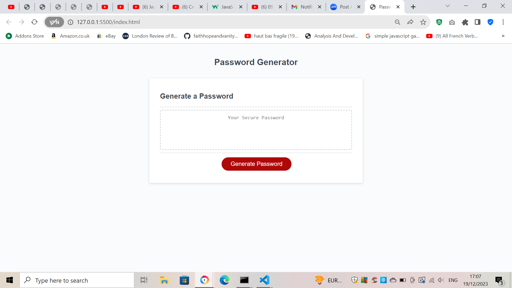
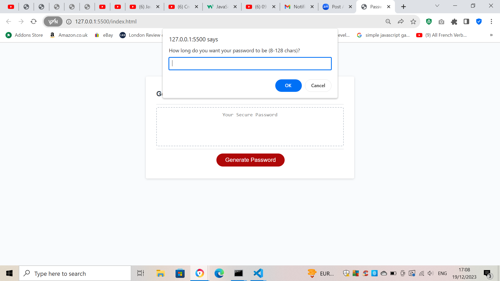

# Module 5 Challenge: Password Generator

## Overview

This week’s challenge required me to create an application that a user can use to generate a random password based on criteria they’ve selected by modifying starter code. This app will run in the browser, and will feature dynamically updated HTML and CSS powered by JavaScript code that I've written.

## Criteria

-   Generate a password when the button is clicked
    -   Present a series of prompts for password criteria
        -   Length of password
            -   At least 8 characters but no more than 128.
        -   Character types
            -   Lowercase
            -   Uppercase
            -   Numeric
            -   Special characters ($@%&\*, etc) - limited to those specified in my string
    -   Code should validate for each input and at least one character type should be selected
    -   Once prompts are answered then the password should be generated and displayed in an alert or written to the page

## For Review

I was required to submit the following for review:

-   The URL of the deployed application.

-   The URL of the GitHub repository. Give the repository a unique name and include a README describing the project.

---

## Images

